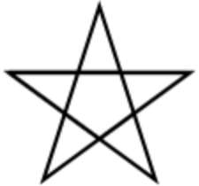
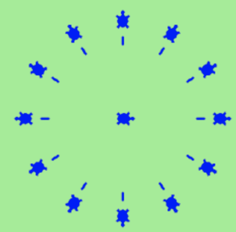

# Instructions  

The material for this lesson is based on [Chapter 3: Hello, little turtles](https://learnpythontherightway.com/chapter/chapter-3.html).

For this lesson, you will be required to complete the  exercises below. 

Make sure to write your solutions in the `main.py` file.


1. Write a program that prints `We like Python's turtles!` 1000 times.


2. Give three attributes of your cellphone object. Give three methods of your cellphone.


3. Write a program that uses a `for` loop to print

    ```python
    One of the months of the year is January
    One of the months of the year is February
    ...
    ```

4. Suppose our turtle tess is at heading `0` — facing east. We execute the statement `tess.left(3645)`. What does tess do, and what is her final heading?


5. Assume you have the assignment `xs = [12, 10, 32, 3, 66, 17, 42, 99, 20]`

  a. Write a loop that prints each of the numbers on a new line.
 
  b. Write a loop that prints each number and its square on a new line.
  c. Write a loop that adds all the numbers from the list into a variable called `total`. You should set the `total` variable to have the value `0` before you start adding them up, and print the value in total after the loop has completed.
  
  d. Print the product of all the numbers in the list. (product means all multiplied together)


6. Use `for` loops to make a turtle draw these regular polygons (regular means all sides the same lengths, all angles the same):
   - An equilateral triangle
   - A square
   - A hexagon (six sides)
   - An octagon (eight sides)


7. A drunk pirate makes a random turn and then takes `100` steps forward, makes another random turn, takes another `100` steps, turns another random amount, etc. A social science student records the angle of each turn before the next 100 steps are taken. Her experimental data is `[160, -43, 270, -97, -43, 200, -940, 17, -86]`. (Positive angles are counter-clockwise.) Use a turtle to draw the path taken by our drunk friend.


8. Enhance your program above to also tell us what the drunk pirate’s heading is after he has finished stumbling around. (Assume he begins at heading `0`).


9. If you were going to draw a regular polygon with 18 sides, what angle would you need to turn the turtle at each corner?


10. At the interactive prompt, anticipate what each of the following lines will do, and then record what happens. Score yourself, giving yourself one point for each one you anticipate correctly:

```python
>>> import turtle
>>> wn = turtle.Screen()
>>> tess = turtle.Turtle()
>>> tess.right(90)
>>> tess.left(3600)
>>> tess.right(-90)
>>> tess.speed(10)
>>> tess.left(3600)
>>> tess.speed(0)
>>> tess.left(3645)
>>> tess.forward(-100)
```

11. Write a program to draw a shape like this:



Hints:

-  Try this on a piece of paper, moving and turning your cellphone as if it was a turtle. Watch how many complete rotations your cellphone makes before you complete the star. Since each full rotation is 360 degrees, you can figure out the total number of degrees that your phone was rotated through. If you divide that by 5, because there are five points to the star, you’ll know how many degrees to turn the turtle at each point.


- You can hide a turtle behind its invisibility cloak if you don’t want it shown. It will still draw its lines if its pen is down. The method is invoked as `tess.hideturtle()`. To make the turtle visible again, use `tess.showturtle()`.

12. Write a program to draw a face of a clock that looks something like this:



13. Create a turtle, and assign it to a variable. When you ask for its type, what do you get?


14. What is the collective noun for turtles? (Hint: they don’t come in _herds_.)


15. What the collective noun for pythons? Is a python a viper? Is a python venomous?